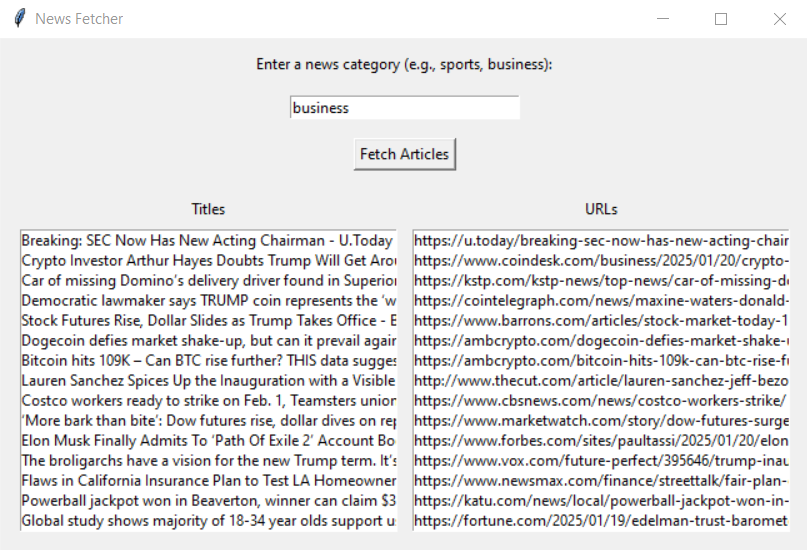

# NewsFetcher

**NewsFetcher** est un projet développé en **Python** qui permet de rechercher automatiquement les dernières actualités sur n’importe quel sujet via une interface simple.  
L’utilisateur peut saisir un mot-clé et obtenir instantanément les liens vers les articles les plus récents sur le web.

---

## 🚀 Fonctionnalités principales

📰 **Recherche de news** :  
- Saisie d’un mot-clé dans l’application (ex. : sport, technologie, politique, biologie…)  
- Collecte automatique des liens d’actualités les plus pertinents sur Internet  

🌐 **Navigation rapide** :  
- Chaque lien est cliquable  
- Ouvre directement la page web de l’actualité sélectionnée dans le navigateur par défaut  

🖥️ **Interface utilisateur simple** :  
- Fenêtre intuitive avec un espace de recherche et une liste de résultats sous forme de liens  

---

## 🎥 Démonstration

### 1️⃣ Capture d’écran – Interface principale
Cette capture montre l’interface de l’application **NewsFetcher** :  
- Zone pour saisir le mot-clé  
- Liste des liens générés correspondant aux dernières actualités  

---

### 2️⃣ Vidéo – Simulation de l’application
La vidéo présente :  
- Comment saisir un mot-clé  
- La génération automatique des liens vers les dernières actualités  
- L’ouverture d’une actualité en cliquant sur un lien  

🎬 [Voir la vidéo de démonstration](news_video.mp4)

---

## 📂 Fichier Python
Le code source du projet est inclus dans ce repository : [`News_Ftecher.ipynb`](News_Ftecher.ipynb).  
Ce fichier contient tout le script Python pour :  
- Créer l’interface graphique  
- Rechercher les actualités sur Internet  
- Afficher les liens cliquables pour chaque résultat  

---

## 🎯 Objectif du projet
Ce projet illustre :  
- Mes compétences en **Python** pour le développement d’applications interactives  
- La mise en place d’un mini‑outil de **web scraping et d’agrégation d’informations**  
- La création d’une interface utilisateur simple et fonctionnelle  

---

📧 Contact: youssefbenyahia6@gmail.com  
🌍 Portfolio : [https://youssef0612.github.io/Portfolio/](https://youssef0612.github.io/Portfolio/)
